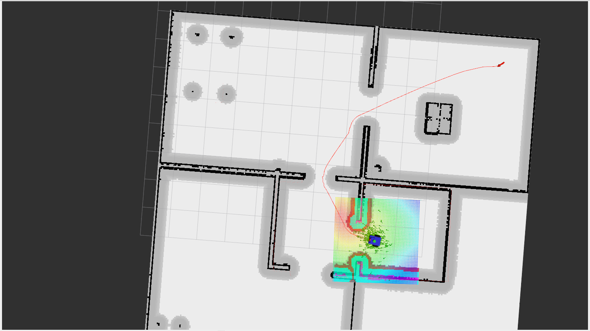

# Garuda Robot 🤖

A ROS2 differential drive robot built for autonomous navigation, mapping, and SLAM operations in Gazebo simulation environment.


## Table of Contents
- [Overview](#overview)
- [Features](#features)
- [System Requirements](#system-requirements)
- [Installation](#installation)
  - [Ubuntu 24.04 Installation](#ubuntu-2404-installation)
  - [ROS2 jazzy Installation](#ros2-jazzy-installation)
  - [Gazebo Harmonic Installation](#gazebo-harmonic-installation)
  - [Dependencies Installation](#dependencies-installation)
  - [Project Setup](#project-setup)
- [Package Structure](#package-structure)
- [Usage](#usage)
  - [URDF Validation](#urdf-validation)
  - [Gazebo Simulation](#gazebo-simulation)
  - [Robot Control](#robot-control)
  - [SLAM and Mapping](#slam-and-mapping)
  - [Navigation](#navigation)
  - [Navigation with SLAM](#navigation-with-slam)
- [Screenshots](#screenshots)
- [Contributing](#contributing)
- [License](#license)

## Overview

Garuda Robot is a comprehensive ROS2 project featuring a differential drive robot designed for autonomous navigation and simultaneous localization and mapping (SLAM). The project includes complete simulation setup, robot description, sensor integration, and navigation stack implementation.


## Features

- **Complete Robot Description**: URDF models with materials and Gazebo plugins
- **Simulation Environment**: Custom Gazebo worlds and spawn configurations
- **Sensor Fusion**: EKF (Extended Kalman Filter) for state estimation
- **Teleoperation**: Keyboard and joystick control support
- **SLAM Capability**: Real-time mapping using Nav2 stack
- **Autonomous Navigation**: Path planning in known and unknown environments
- **Modular Design**: Well-organized package structure for easy maintenance

## System Requirements

- **Operating System**: Ubuntu 24.04 LTS
- **ROS Version**: ROS2 Jazzy
- **Gazebo Version**: Gazebo Harmonic (gz_sim)
- **RAM**: Minimum 4GB (8GB recommended)
- **Storage**: At least 10GB free space

## Installation

### Ubuntu 24.04 Installation

1. Download Ubuntu 24.04 LTS from [official website](https://ubuntu.com/download/desktop)
2. Create a bootable USB drive using tools like Rufus or balenaEtcher
3. Install Ubuntu following the installation wizard
4. Update your system:
```bash
sudo apt update && sudo apt upgrade -y
```

### ROS2 Jazzy Installation

1. Set up ROS2 repository:
```bash
sudo apt install software-properties-common
sudo add-apt-repository universe
sudo apt update && sudo apt install curl -y
sudo curl -sSL https://raw.githubusercontent.com/ros/rosdistro/master/ros.key -o /usr/share/keyrings/ros-archive-keyring.gpg
echo "deb [arch=$(dpkg --print-architecture) signed-by=/usr/share/keyrings/ros-archive-keyring.gpg] http://packages.ros.org/ros2/ubuntu $(. /etc/os-release && echo $UBUNTU_CODENAME) main" | sudo tee /etc/apt/sources.list.d/ros2.list > /dev/null
```

2. Install ROS2 Jazzy:
```bash
sudo apt update
sudo apt install ros-jazzy-desktop -y
```

3. Install additional ROS2 tools:
```bash
sudo apt install python3-argcomplete python3-colcon-common-extensions python3-rosdep python3-vcstool -y
```

4. Initialize rosdep:
```bash
sudo rosdep init
rosdep update
```

5. Set up environment:
```bash
echo "source /opt/ros/jazzy/setup.bash" >> ~/.bashrc
source ~/.bashrc
```

### Gazebo Harmonic Installation

1. Install Gazebo Harmonic:
```bash
sudo apt-get update
sudo apt-get install lsb-release wget gnupg

sudo wget https://packages.osrfoundation.org/gazebo.gpg -O /usr/share/keyrings/pkgs-osrf-archive-keyring.gpg
echo "deb [arch=$(dpkg --print-architecture) signed-by=/usr/share/keyrings/pkgs-osrf-archive-keyring.gpg] http://packages.osrfoundation.org/gazebo/ubuntu-stable $(lsb_release -cs) main" | sudo tee /etc/apt/sources.list.d/gazebo-stable.list > /dev/null

sudo apt-get update
sudo apt-get install gz-harmonic -y
```

2. Install Gazebo-ROS2 bridge:
```bash
sudo apt install ros-jazzy-ros-gz -y
```

### Dependencies Installation

Install required ROS2 packages and dependencies:

```bash
# Navigation and SLAM packages
sudo apt install ros-jazzy-nav2-bringup ros-jazzy-nav2-msgs -y
sudo apt install ros-jazzy-robot-localization -y
sudo apt install ros-jazzy-slam-toolbox -y

# Control packages
sudo apt install ros-jazzy-teleop-twist-keyboard -y
sudo apt install ros-jazzy-joy ros-jazzy-teleop-twist-joy -y
sudo apt install ros-jazzy-controller-manager -y
sudo apt install ros-jazzy-diff-drive-controller -y
sudo apt install ros-jazzy-joint-state-broadcaster -y

# URDF and robot description packages
sudo apt install ros-jazzy-urdf ros-jazzy-xacro -y
sudo apt install ros-jazzy-robot-state-publisher -y
sudo apt install ros-jazzy-joint-state-publisher -y
sudo apt install ros-jazzy-joint-state-publisher-gui -y

# Gazebo plugins
sudo apt install ros-jazzy-gazebo-ros-pkgs -y
sudo apt install ros-jazzy-gazebo-plugins -y

# Additional utilities
sudo apt install ros-jazzy-tf2-tools -y
sudo apt install ros-jazzy-rqt -y
sudo apt install ros-jazzy-rviz2 -y
```

### Project Setup

1. Create workspace and clone repository:
```bash
mkdir -p ~/garuda_ws/src
cd ~/garuda_ws/src
git clone https://github.com/yourusername/garuda_robot.git
```

2. Install dependencies using rosdep:
```bash
cd ~/garuda_ws
rosdep install --from-paths src --ignore-src -r -y
```

3. Build the project:
```bash
cd ~/garuda_ws
colcon build
```

4. Source the workspace:
```bash
source ~/garuda_ws/install/setup.bash
echo "source ~/garuda_ws/install/setup.bash" >> ~/.bashrc
```

## Package Structure

```
garuda_robot/
├── garuda_description/     # Robot URDF, materials, and validation
├── garuda_gazebo/         # Gazebo worlds and spawn configurations  
├── garuda_ekf/            # EKF configuration for sensor fusion
├── garuda_control/        # Teleoperation (keyboard and joystick)
├── garuda_slam/           # SLAM and mapping capabilities
├── garuda_navigation/     # Autonomous navigation stack
└── doc/
    └── images/           # Documentation images
```

### Package Details

- **garuda_description**: Contains URDF files, materials, Gazebo plugins, and `check_urdf_file.launch.py` for robot validation
- **garuda_gazebo**: Gazebo simulation environments, `spawn_robot.launch.py`, and world configurations
- **garuda_ekf**: EKF node configuration for sensor fusion and state estimation
- **garuda_control**: Teleoperation nodes for keyboard and joystick control
- **garuda_slam**: SLAM implementation using Nav2 stack for real-time mapping
- **garuda_navigation**: Autonomous navigation in known maps and unknown environments

## Usage

### URDF Validation

Validate the robot URDF model:
```bash
ros2 launch garuda_description check_urdf.launch.py
```

This will check if the robot model is correctly defined and display any issues.

### Gazebo Simulation

1. Launch Gazebo world:
```bash
ros2 launch garuda_gazebo world.launch.py
```

2. Spawn the robot in Gazebo:
```bash
ros2 launch garuda_gazebo spawn_robot.launch.py
```


### Robot Control

Control the robot using keyboard:
```bash
ros2 launch garuda_control teleop_keyboard.launch.py
```

Or use joystick control:
```bash
ros2 launch garuda_control teleop_joy.launch.py
```

### SLAM and Mapping

Launch SLAM for mapping unknown environments:
```bash
ros2 launch garuda_slam mapping.launch.py
```

This will start the SLAM toolbox and allow you to create maps while exploring the environment.



### Navigation

For autonomous navigation in known maps:
```bash
ros2 launch garuda_navigation navigation.launch.py
```

### Navigation with SLAM

For navigation in unknown environments with simultaneous mapping:
```bash
ros2 launch garuda_navigation navigation_with_slam.launch.py
```

## Screenshots

### Robot Model


### SLAM in Action


### Navigation Interface


### Workspace Setup


## Launch Sequence

For a complete simulation session, follow this sequence:

1. **Terminal 1** - Launch Gazebo world:
```bash
ros2 launch garuda_gazebo world.launch.py
```

2. **Terminal 2** - Spawn robot:
```bash
ros2 launch garuda_gazebo spawn_robot.launch.py
```

3. **Terminal 3** - Choose your operation mode:

   For mapping:
   ```bash
   ros2 launch garuda_slam mapping.launch.py
   ```

   For navigation:
   ```bash
   ros2 launch garuda_navigation navigation.launch.py
   ```

   For navigation with SLAM:
   ```bash
   ros2 launch garuda_navigation navigation_with_slam.launch.py
   ```

4. **Terminal 4** - Control robot (if needed):
```bash
ros2 launch garuda_control teleop_keyboard.launch.py
```

## Troubleshooting

### Common Issues

1. **Gazebo not starting**: Ensure Gazebo Harmonic is properly installed and sourced
2. **URDF errors**: Run the URDF checker to identify model issues
3. **Navigation not working**: Check if map is loaded and robot localization is active
4. **Control not responding**: Verify controller nodes are running and topics are published

### Useful Commands

```bash
# Check active topics
ros2 topic list

# Monitor robot state
ros2 topic echo /robot_state

# View TF tree
ros2 run tf2_tools view_frames

# Check node status
ros2 node list
```

## Contributing

Contributions are welcome! Please follow these steps:

1. Fork the repository
2. Create a feature branch (`git checkout -b feature/amazing-feature`)
3. Commit your changes (`git commit -m 'Add amazing feature'`)
4. Push to the branch (`git push origin feature/amazing-feature`)
5. Open a Pull Request

## License

This project is licensed under the Apache License - see the [LICENSE](LICENSE) file for details.

---

**Happy Robotics! 🤖**

For questions or support, please open an issue on GitHub. or 
contact:
Prudhvi Raj
prudhvirajchalapaka@gmail.com
